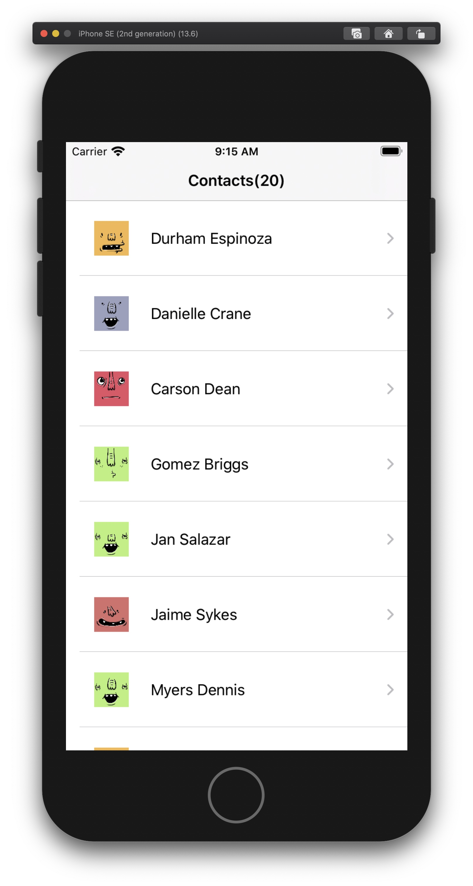
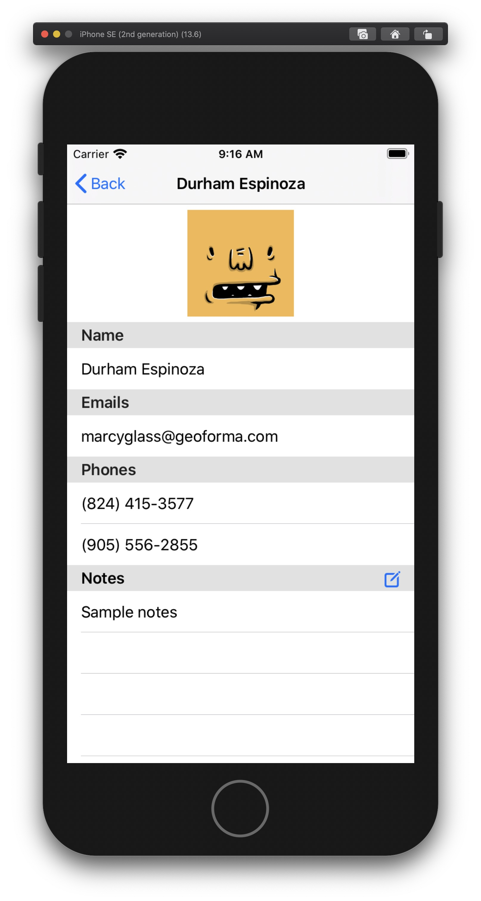
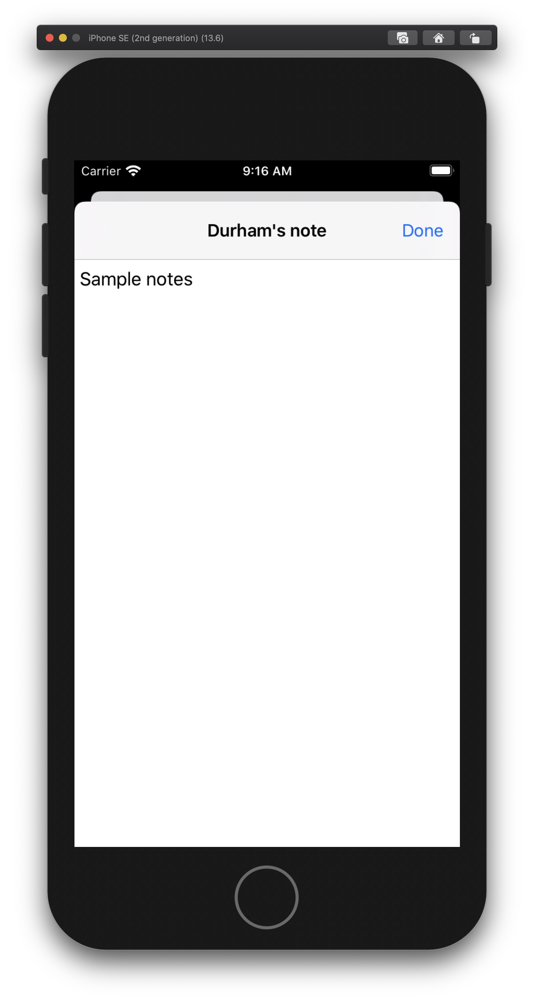

# ResearchNotes

## Features
1. Tiny reactive networking library with Generics & Combine
2. Demonstrates MVVM pattern with two way view binding
3. SwiftUI based view layer
4. Incremental paging

## TODO
1. More unit tests
2. Coordinators: To handle app navigation
3. Better error handling
4. Activity indicators

## Screenshots

